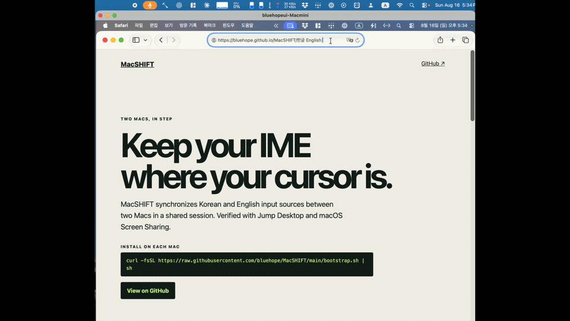

# MacSHIFT

**Mac IME synchronization for shared sessions.**

MacSHIFT keeps macOS input sources aligned between two Macs in a shared session. It currently synchronizes Korean 2-set and ABC input sources without a network service, SSH, clipboard access, or text capture.

[Project website](https://bluehope.github.io/MacSHIFT/) · [한국어 안내](#한국어) · [Website source](docs/)

> Status: Korean/English support is ready. Japanese and Chinese are documented as a future CJK extension, not as a current feature.

## Why MacSHIFT?

### In English

#### Why is this needed?

During a shared Mac session, each Mac keeps its input source and Korean composition state independently. Keystrokes are forwarded, but the Korean/English input state is not.

#### What can go wrong?

When the two input states differ, Korean text may arrive as separated Jamo instead of composed Hangul characters. An unexpected Korean or English state also interrupts typing and requires manual correction on the other Mac.

#### How does MacSHIFT help?

MacSHIFT uses Hammerspoon to send the Korean or English state selected on this Mac to the other Mac as an explicit key signal. After connecting, pressing the configured toggle shortcut once—or using a Korean/English shortcut—aligns the other Mac with the same input state. It has been verified with Jump Desktop and macOS Screen Sharing.

#### What changes?

MacSHIFT quickly aligns input states before typing, reducing separated Jamo and wrong-language input. It uses only keyboard events already carried by the remote session—no separate server, network listener, or clipboard sharing.

### 한국어

#### 왜 필요한가요?

원격 접속 중에도 두 Mac의 입력 소스와 한글 조합 상태는 각각 독립적으로 유지됩니다. 키 입력은 전달되지만, 한/영 상태 자체가 함께 전달되지는 않습니다.

#### 어떤 문제가 생기나요?

두 Mac의 입력 상태가 다를 때, 한글 입력이 완성된 글자가 아니라 자소 단위로 분리되어 들어갈 수 있습니다. 영어·한글 상태가 예상과 다르면 입력을 멈추고 다른 Mac에서 다시 고쳐야 합니다.

#### MacSHIFT는 어떻게 해결하나요?

MacSHIFT는 Hammerspoon을 이용해 이 Mac에서 선택한 한글 또는 영어 상태를 명시적 키 신호로 다른 Mac에 전달합니다. 연결 후 설정한 토글 키를 한 번 누르거나 한/영 단축키를 사용하면, 다른 Mac도 같은 입력 상태로 맞춥니다. Jump Desktop과 macOS Screen Sharing에서 동작을 확인했습니다.

#### 무엇이 달라지나요?

입력 시작 전 두 Mac의 한/영 상태를 빠르게 맞춰 자소 분리와 잘못된 언어 입력을 줄입니다. 별도 서버·네트워크 연결·클립보드 공유 없이, 기존 원격 세션의 키 전달만 사용합니다.

## See it in action

<picture>
  <source media="(min-width: 768px)" srcset="docs/assets/sample-hq.gif">
  
</picture>

## What it supports

- Verified with Jump Desktop and macOS Screen Sharing.
- The installer’s setup labels are `local` for the Mac you connect from, `remote` for the other Mac, and `both` for a Mac used in either direction.
- `Ctrl+Option+H` for Korean (Hangul), `Ctrl+Option+L` for English (Latin), and Right Shift to toggle from this Mac’s current input source.
- Hammerspoon installation through Homebrew when available, plus a daily opt-out-able update check.

## Install

### Clone (recommended)

```sh
git clone https://github.com/bluehope/MacSHIFT.git
cd MacSHIFT
./install.sh
```

### One command

```sh
curl -fsSL https://raw.githubusercontent.com/bluehope/MacSHIFT/main/bootstrap.sh | sh
```

The bootstrap downloads the latest tagged release and verifies its SHA-256 checksum before running the installer. Review the script before using a pipe-to-shell installation.

The installer starts Hammerspoon and reloads its configuration automatically. If macOS requests it, grant **Hammerspoon** Accessibility permission in **System Settings → Privacy & Security → Accessibility**. You can reload manually if needed:

```lua
hs.reload()
```

## Use

Run MacSHIFT on every Mac taking part in the session: the Mac you are using and the other Mac.

- `Ctrl+Option+H` — set this Mac and the active Mac you connect to to Korean
- `Ctrl+Option+L` — set this Mac and the active Mac you connect to to English
- `Right Shift` — toggle Korean/English from this Mac's current input source; when a supported sharing app is frontmost, synchronize it too

After connecting, press the configured toggle shortcut once (`Right Shift` by default). MacSHIFT reads this Mac’s current Korean or English state and applies the same state to the other Mac, regardless of how either Mac started.

The other Mac receives `F18` for Korean and `F19` for English. Use `--role remote` or `--role both` there.

```sh
./install.sh --role local
./install.sh --role remote
./install.sh --role both
```

When no role is provided, Viewer-only selects `local`, Connect-only selects `remote`, and every other case—including Screen Sharing-only Macs—defaults to `both`. This makes the one-command installation work without extra options.

## Updates and configuration

MacSHIFT installs a daily LaunchAgent update check by default. It downloads only tagged GitHub Releases and verifies the supplied SHA-256 checksum. Disable it during installation with `--no-auto-update`.

```sh
./install.sh --check-update
./install.sh --update
```

Your settings live at `~/.config/macshift/config.lua`; installed defaults live beside it in `config.defaults.lua`. Defaults are merged with your settings, so new options can be added without overwriting your role, Source IDs, or shortcuts.

### Customize shortcuts

Edit **`~/.config/macshift/config.lua`**—not `config.defaults.lua`. Replace its entire `imeShortcuts` block with your preferred mappings, then reload Hammerspoon. For example:

```lua
imeShortcuts = {
    korean = { "ctrl", "alt", "H" },
    english = { "ctrl", "alt", "L" },
    toggle = { "rightoption" },
    -- toggle = { "ctrl", "alt", "space" },
    -- toggle = false, -- disable the toggle shortcut
},
```

`imeShortcuts.toggle` accepts either a single modifier key (`rightshift`, `rightoption`, `rightcmd`, or `capslock`) or a normal shortcut with modifiers. Modifier-free character keys are intentionally rejected to avoid intercepting normal typing. Keep `signalKeys` unchanged unless you also make the same change on the other Mac.

```sh
hs -c 'hs.reload()'
```

한국어로는, `~/.config/macshift/config.lua` 안의 **`imeShortcuts` 블록 전체를 위 예시처럼 원하는 키 조합으로 바꾼 뒤** `hs -c 'hs.reload()'`를 실행하면 됩니다.

### Powered by Hammerspoon

[Hammerspoon](https://www.hammerspoon.org/) is MacSHIFT’s runtime, not just an installer dependency: it listens for shortcuts, switches macOS input sources, sends and receives the F18/F19 synchronization signals, and reloads configuration. See the official [Hotkey documentation](https://www.hammerspoon.org/docs/hs.hotkey.html) and [IPC/CLI documentation](https://www.hammerspoon.org/docs/hs.ipc.html).

To identify a different input source ID, run this in Hammerspoon Console:

```lua
dofile("/path/to/MacSHIFT/scripts/show-input-sources.lua")
```

## Troubleshooting

- **No shortcut response:** grant Accessibility permission, run `hs.reload()`, then check for a conflicting shortcut.
- **Other Mac does not change:** make the sharing app frontmost, verify `F18`/`F19` are forwarded, and use `remote` or `both` on the other Mac.
- **Update problem:** inspect `~/.local/state/macshift/update.log`; run `./install.sh --update` manually after fixing network access.

## Privacy and security

MacSHIFT does not open a listener, send keystrokes to a service, read clipboard data, or record typed text. The optional updater contacts GitHub once per day to check the latest public release. See [LICENSE](LICENSE) for usage terms.

## Development

```sh
sh -n install.sh bootstrap.sh scripts/update.sh
luac -p hammerspoon/ime_sync.lua config.defaults.lua config.example.lua
lua tests/test_ime_sync.lua
sh tests/test_release_tools.sh
```

---

## 한국어

MacSHIFT는 원격으로 접속한 두 Mac의 macOS 입력 소스를 맞춰 주는 도구입니다. 현재는 두벌식 한국어와 ABC 영어를 지원합니다. Jump Desktop 및 macOS Screen Sharing에서 작동을 확인했습니다.

### 설치

```sh
git clone https://github.com/bluehope/MacSHIFT.git
cd MacSHIFT
./install.sh
```

또는 태그된 릴리스를 검증해 설치합니다.

```sh
curl -fsSL https://raw.githubusercontent.com/bluehope/MacSHIFT/main/bootstrap.sh | sh
```

설치기는 Hammerspoon을 실행하고 설정을 자동으로 다시 읽습니다. macOS가 요청하면 **시스템 설정 → 개인정보 보호 및 보안 → 손쉬운 사용**에서 Hammerspoon을 허용합니다. 필요하면 Hammerspoon Console에서 `hs.reload()`를 다시 실행할 수 있습니다.

### 사용

- `Ctrl+Option+H`: 한글(Hangul)로 지정
- `Ctrl+Option+L`: 영어(Latin)로 지정
- `Right Shift`: 로컬 한/영 토글. 원격 앱이 앞에 있으면 원격에도 동기화

접속한 뒤 설정한 토글 키(기본값 `Right Shift`)를 한 번 누르면, 이 Mac의 현재 한/영 상태를 기준으로 다른 Mac도 같은 상태로 맞춥니다. 두 Mac이 어떤 상태에서 시작했는지와 관계없이 동기화됩니다.

원격 Mac은 `F18`(한글), `F19`(영어) 신호를 받습니다. 접속하는 Mac은 `--role local`, 접속받는 Mac은 `--role remote`, 양쪽 역할을 모두 쓸 Mac은 `--role both`로 설치할 수 있습니다.

기본값으로 하루 한 번 새 GitHub Release를 확인해 검증 후 갱신합니다. 원하지 않으면 `./install.sh --no-auto-update`을 사용하세요. 사용자가 바꾼 설정은 `~/.config/macshift/config.lua`에 보존됩니다.

원본 작업 사양과 CJK 확장 설계는 배포 기능과 분리되어 있으며, 현재 공개 지원 범위는 KO/EN입니다.
